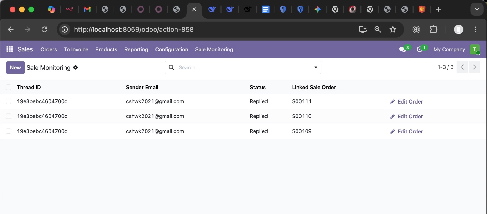
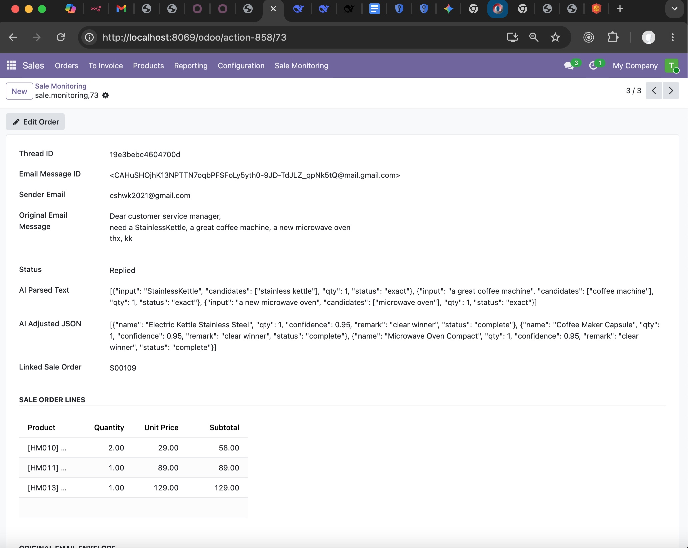
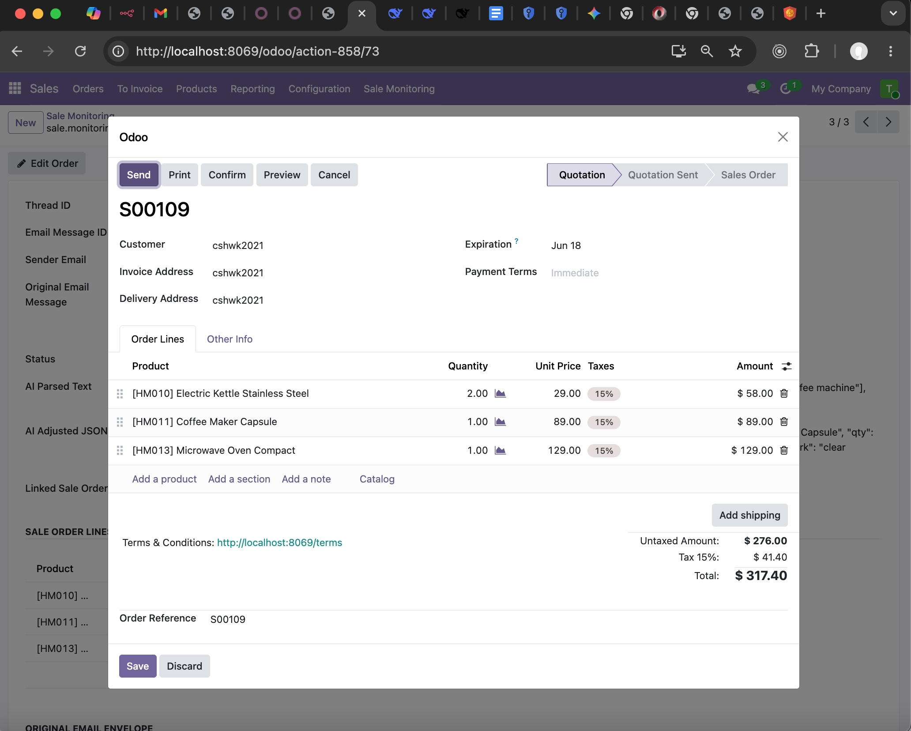

## ODOO Addon Module: automation for sale monitoring  

>### Introduction: 

- After automated email sale order created, automation_sale_monitoring module is used to track status whether the email body is clear enough for success creation of sale order, or need manual fix by staff.

>### model status:
```
    status = fields.Selection([
        ("pending_reply", "Pending Reply"),
        ("pending_fix", "Pending Fix"),
        ("replied", "Replied"),
    ], default="pending_fix")
```

>### model FK linked to Sale Order:
```
     sale_order_id = fields.Many2one("sale.order", string="Linked Sale Order", required=False)
```

>### If email body information clear to be extracted, model auto-create both sale order and sale monitoring record:
```
    @api.model
    def create_order_with_monitoring(self, vals_order, vals_monitoring):

        order = self.env["sale.order"].create(vals_order)

        vals_monitoring["sale_order_id"] = order.id
        monitoring = self.create(vals_monitoring)
     
        return {
            "order_id": order.id,
            "monitoring_id": monitoring.id,
            "status": True,
        }

```


>### If email body unclear and information cannot be extracted, model ONLY create sale monitoring record for staff to follow the case:
```
    @api.model
    def create_monitoring_only(self, vals_monitoring):
       
        .......
        vals_monitoring["sale_order_id"] = False
        monitoring = self.create(vals_monitoring)

        return {
            "monitoring_id": monitoring.id,
            "status": True,
            "msg": "Monitoring record created"
        }
```


>### Full Model Fields:
```
class SaleMonitoring(models.Model):
    _name = "sale.monitoring"
    _description = "Sale Monitoring for Initial Emails"
    _inherit = ["mail.thread", "mail.activity.mixin"]

    thread_id = fields.Char("Thread ID")
    email_msg_id = fields.Char("Email Message ID")
    sender_email = fields.Char("Sender Email")
    original_email_message = fields.Text("Original Email Message")
    original_email_body = fields.Text("Original Email Body")

    status = fields.Selection([
        ("pending_reply", "Pending Reply"),
        ("pending_fix", "Pending Fix"),
        ("replied", "Replied"),
    ], default="pending_fix")

    ai_parse_text = fields.Text("AI Parsed Text")
    ai_mmr_json = fields.Text("AI Adjusted JSON")

    # Link 去正式 sale order
    sale_order_id = fields.Many2one("sale.order", string="Linked Sale Order", required=False)

    # Related partner_id，避免 duplicate
    partner_id = fields.Many2one(
        related="sale_order_id.partner_id",
        string="Sender Partner",
        store=False,      # 唔需要存，只係顯示
        readonly=True
    )

    # 直接顯示 sale order line
    order_line_ids = fields.One2many(
        related="sale_order_id.order_line",
        string="Sale Order Lines",
        readonly=True
    )
```


>### XML View to listing sale monitoring records:
```
<!-- List View -->
    <record id="view_sale_monitoring_list" model="ir.ui.view">
        <field name="name">sale.monitoring.list</field>
        <field name="model">sale.monitoring</field>
        <field name="arch" type="xml">
            <list string="Sale Monitoring" default_order="id desc">
                <field name="thread_id"/>
                <field name="sender_email"/>
                <field name="status"/>
                <field name="sale_order_id"/>
                <button name="action_open_sale_order_popup"
                        type="object"
                        string="Edit Order"
                        icon="fa-pencil"
                        invisible="sale_order_id == False"/>


            </list>
        </field>
    </record>
```


 


>### XML View to update status of sale monitoring record:
```
<!-- Form View -->
    <record id="view_sale_monitoring_form" model="ir.ui.view">
        <field name="name">sale.monitoring.form</field>
        <field name="model">sale.monitoring</field>
        <field name="arch" type="xml">
            <form string="Sale Monitoring">
                <header>
                    <!-- 如果係 sale_order_id → Edit -->
                    <button name="action_open_sale_order_popup"
                            type="object"
                            string="Edit Order"
                            icon="fa-pencil"
                            invisible="sale_order_id == False"/>

                    <!-- 如果冇 sale_order_id → Add -->
                    <button name="action_add_sale_order_popup"
                            type="object"
                            string="Add Sale Order"
                            icon="fa-plus"
                            invisible="sale_order_id != False"/>
                </header>
                <sheet>
                    <!-- 加 class 強制 vertical -->
                    <group class="force-vertical">
                        <field name="thread_id"/>
                        <field name="email_msg_id"/>
                        <field name="sender_email"/>
                        <field name="original_email_message"/>
                        <field name="status"/>
                        <field name="ai_parse_text"/>
                        <field name="ai_mmr_json"/>
                        <field name="sale_order_id"/>
                    </group>

                    <group string="Sale Order Lines" class="force-vertical">
                        <field name="order_line_ids" nolabel="1" readonly="1">
                            <list>
                                <field name="product_id"/>
                                <field name="product_uom_qty"/>
                                <field name="price_unit"/>
                                <field name="price_subtotal"/>
                            </list>
                        </field>
                    </group>

                    <group string="Original Email Envelope" class="force-vertical">
                        <field name="original_email_body"/>
                    </group>
                </sheet>
            </form>
        </field>
    </record>

```


 


 

